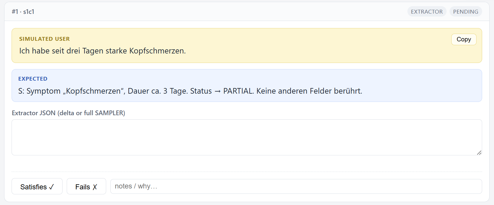

# ED Intake & Informational Support Chatbot — Benchmark Harness

A self-contained, **manual evaluation harness** for the ED intake and informational support
chatbot. It is a static HTML/CSS/JS page (no backend, no build step, no dependency on the
running app).

You run each predefined **simulated-user (SU)** prompt against the real chat, then paste
back what actually happened — the user-facing **AI answer** and/or the **Extractor / SAMPLER**
output — and judge whether it satisfies expectations. The harness records everything, shows a
live results table, and prints a PDF report.



*A single evaluation card — yellow SU prompt (+ Copy), the expected result, the capture field(s), and the Satisfies/Fails verdict with notes.*

## Quick start

Open `index.html` in a browser. That's it — no server, no build step. Everything (autosave,
copy-to-clipboard, export/import, print) works straight from `file://`.

## Workflow

1. Fill in the header: **tester**, **model / commit**, **date**, and pick the **prompt language** (DE/EN).
2. For each SU card:
   - Click **Copy** to copy the SU prompt, paste it into the real chat.
   - Follow the section instruction about chat lifecycle (see below).
   - Paste the result(s) into the card's capture field(s).
   - Click **Satisfies ✓** or **Fails ✗** and add a note. This **freezes** the card.
   - Need to change it? Click **Edit** to unlock (or click the verdict again to clear + unlock).
3. Watch the **results table**, **accuracy grade**, and progress line update live.
4. Click **Print results** → browser "Save as PDF" for the report.

## Final grade (accuracy)

The header shows a live **accuracy** percentage:

```
accuracy = passed cases / total cases × 100
```

- While cases are still unjudged it is labelled **"accuracy so far"** and is a lower bound
  (pending cases count against the total). Once every case has a verdict it becomes the
  **"final accuracy"** — the run's grade.
- The same percentage is printed in the PDF report header (marked *provisional* if any case is
  still pending).

## Sections

| # | Section | Chat lifecycle | Captures |
|---|---|---|---|
| 1 | Single, unrelated prompts (10) | New chat **before every** prompt | Extractor JSON |
| 2 | Full end-to-end intake (8 turns) | **One** continuous chat — do **not** reload | AI answer + Extractor |
| 3 | ED-info one-liners (3) | **Reload** chat between prompts | AI answer |
| 4 | Questionable info (4) | New chat **before every** prompt | AI answer + Extractor |

- **Section 2** opens with a *Full intake overview* panel (the target SAMPLER data) and abides by
  the SAMPLER order (S → A → M → P → L → E → R). Each card also has a **topic-completeness
  checkbox** — tick it when the AI actually finished gathering the current topic before moving on
  (it catches the failure mode of advancing too early, e.g. with only half the symptoms). The
  state is saved and printed; it's an extra observation that does not change the accuracy formula.
- **Section 3** captures the AI answer (`EdInfoResponse`) — `hospital_info` turns produce no
  SAMPLER change, so there is nothing for the extractor to capture.

> **Captures legend** — `AI`: user-facing AI answer; `Extr`: AI-powered extraction of medical data; `AI+Extr`: both.

## Capture model

The verdict is fundamentally about whether the **extractor** did the right thing; the end-to-end
section additionally captures the AI answer because follow-up quality matters there. The
**Extractor JSON** box accepts either the `field_status_updates` delta or the full post-turn
`sampler_data`, and does live JSON validation (green/red border) — invalid JSON is still saved.

## Files

```
.
├── index.html      # page shell: header, section outline, sections container, results table
├── styles.css      # styling + the @media print report stylesheet
├── app.js          # rendering, autosave, copy, verdict/freeze, JSON validation, export/import, print, header toggle
├── cases.js        # THE DATASET — all SU prompts, expectations, and section config
├── README.md
├── LICENSE         # MIT
└── imgs/           # screenshots used in this README
```

Everything is static — no build step, no dependencies. The only file you normally edit to change
what gets tested is `cases.js`.

## Editing the dataset

Everything lives in `cases.js` — no need to touch `app.js`. A section looks like:

```js
{
  id: "s1",
  title:       { de: "...", en: "..." },
  instruction: { de: "...", en: "..." },
  capture: ["extractor"],              // section default: "extractor" | "ai" | both
  overviewTitle: { de: "...", en: "..." },   // optional intro panel (used by section 2)
  overview:      { de: ["• ...", ...], en: ["• ...", ...] },
  cases: [
    {
      id: "s1c1",
      prompt:   { de: "...", en: "..." },
      expected: { de: "...", en: "..." },
      capture: ["ai", "extractor"],    // optional per-case override of the section default
    },
  ],
}
```

- `prompt` and `expected` are bilingual and switch with the language dropdown.
- `capture` controls which fields a card shows: `"extractor"`, `"ai"`, or both.
- `topicCheck` (section-level, bilingual) adds a per-card completeness checkbox to every case in
  that section; `"{topic}"` in the label is replaced with each case's `topic` ({ de, en }). Used
  by the end-to-end intake to flag whether the AI finished a topic before advancing.
- Case `id`s must be **unique and stable** — they are the localStorage keys for saved answers.
  Renaming an `id` orphans its previously recorded data.

## Persistence, export, backup

- All answers, verdicts, notes, and header meta **autosave to `localStorage`** — reload-safe.
- **Export JSON** downloads `{ meta, results }`; **Import JSON** restores it.
- **Clear all** wipes recorded answers (with confirmation). Header collapse state is also persisted.

## Printing

**Print results** uses `window.print()`. The print stylesheet hides all interactive chrome,
renders the pasted answers as readable text blocks (textareas are swapped for text mirrors so
nothing is clipped), adds a report header with the run metadata, and includes the full results
table. Choose "Save as PDF" as the destination.

## License

Released under the [MIT License](LICENSE).
